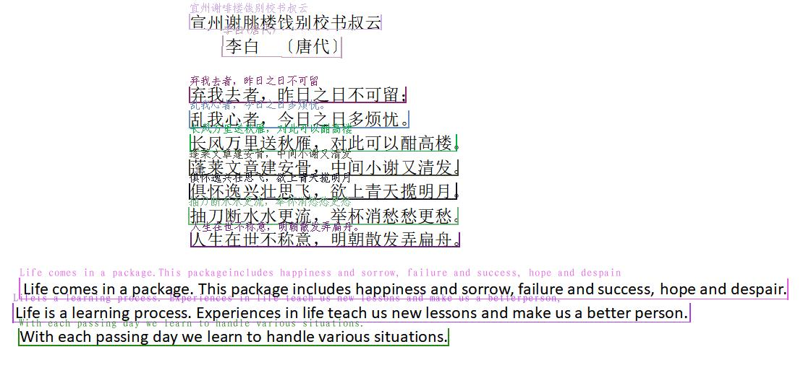
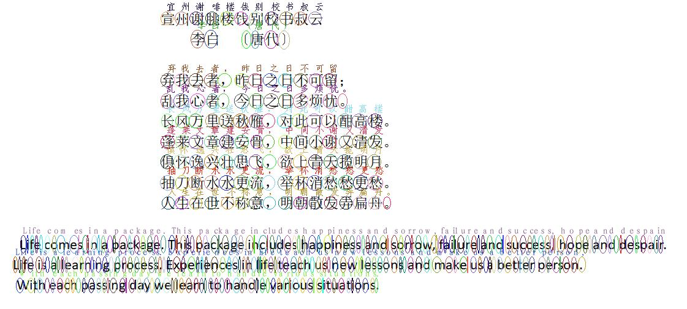
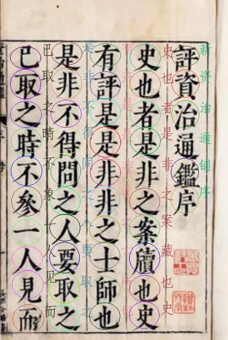
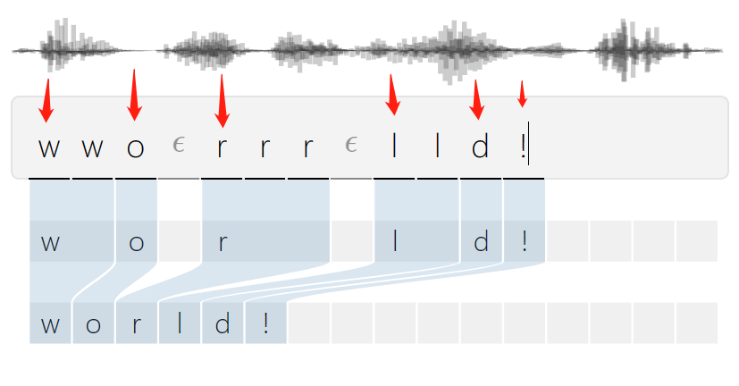
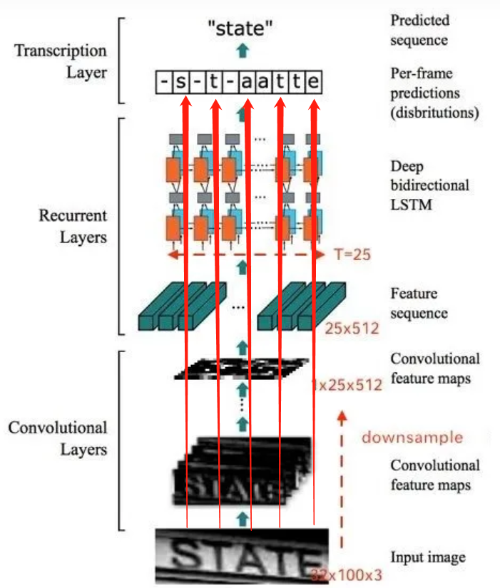

# 字符（单字）检测

## 效果

横版文本行  `python model.py --level line --images images/0.png`

横版单词，中文每个字都分割，英文按照标点符号进行分割  `python model.py --level word --images images/0.png`

横版字符  `python model.py --level char --images images/0.png`

竖版文字  `python model.py --level char --images images/1.png`

## 原理

字符出现

利用ctc loss 解析时的位置信息

crnn后处理字符出现的位置和图片的位置恰好对应，如100宽的图片处理后有10个字符，一个字符代表10像素，`-s-t-aatte` 第一个s起点代表10px，第二个t起点是30px，依此类推

## 安装和使用

安装依赖：`pip install requirements.txt`

使用:

单词级别：`python model.py --level word`

字符级别：`python model.py --level char`

文本行级别：`python model.py --level line`

## reference

OCR引擎 [https://github.com/DayBreak-u/chineseocr_lite](https://github.com/DayBreak-u/chineseocr_lite)